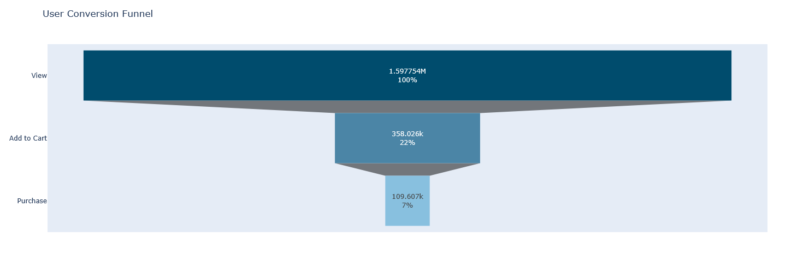

# 🤖 AI Marketing Agent

An interactive AI-powered dashboard that combines data analytics, user segmentation, **predictive modeling**, and marketing content generation into one intelligent assistant.  
Built with **Python, Streamlit, scikit-learn, and Mistral**, this project helps marketers make smarter, proactive decisions through data-driven insights and AI suggestions.

---

## 🚀 Overview

This tool is designed to simulate how a junior data analyst or marketing team could use AI to:

- Understand user behavior from raw eCommerce event data.
- Segment customers using two complementary techniques: **RFM Analysis** and **Behavioral Clustering**.
- **Predict future user behavior**, specifically identifying customers likely to churn (leave) or be retained (make a repeat purchase).
- Visualize key marketing metrics such as funnel conversion and predicted churn rates.
- Interact with a conversational **AI Marketing Agent** that generates ideas and campaign strategies based on both historical data and future predictions.

---

## 📊 Key Features

### 1. Predictive Churn & Retention Modeling
The core of this enhancement is a machine learning model that predicts user activity in the next month.
- **Two separate models** are trained: one for existing buyers (predicting retention) and one for non-buyers (predicting acquisition/first purchase).
- Utilizes **XGBoost** and **Keras (TensorFlow)** to find the best-performing algorithm for each segment.
- The output provides a **probability score** for each user, allowing for targeted, proactive marketing campaigns.

### 2. Conversion Funnel Visualization
Track user progression through the sales funnel:
- Product View → Add to Cart → Purchase
- Built with Plotly for interactive exploration.
- Helps identify drop-off stages and conversion efficiency.


### 3. Dual Segmentation Engine
Two powerful segmentation approaches are implemented to provide a deep, multi-faceted understanding of the customer base:

- **RFM Analysis**:
  - Segments customers based on **R**ecency, **F**requency, and **M**onetary value, enhanced with K-Means clustering.
  - Clusters include: *Champions*, *Loyal Customers*, *Promising / Potential Loyalists*, *New/Occasional Users*, *At Risk*, and *Lost*.

- **Behavioral Clustering**:
  - Uses unsupervised learning (K-Means) on user engagement metrics (e.g., sessions, items viewed).
  - Clusters include: *Champions*, *Loyal / Regular Shoppers*, *Promising / Active Shoppers*, and *Newcomers / Casual Visitors*.

These two methods **complement each other**, offering layered insights for personalized marketing.

### 4. AI Marketing Agent
Built with **Mistral** (via `mistralai`), this conversational assistant is now even smarter:

- **Generates tailored marketing campaigns** for at-risk users or high-potential new customers.
- Recommends "next best actions" for each segment, now informed by churn probability.
- Suggests product pairings or promotions to prevent churn.
- Summarizes user behavior in natural language, combining historical patterns with future predictions.

---

## 🧰 Tools & Tech Stack

| Category                  | Tools                                                              |
|---------------------------|--------------------------------------------------------------------|
| **Predictive Modeling**   | **scikit-learn, XGBoost, Keras (TensorFlow)**                        |
| Language Model            | Mistral via `mistralai` API                                        |
| Analytics & Data Prep     | Python, pandas, numpy, matplotlib, seaborn                         |
| ML / Clustering           | scikit-learn (KMeans)                                              |
| AI Agent                  | Custom Mistral integration                                         |
| UI / App                  | Streamlit + Plotly                                                 |

---

## 📊 Example Visuals

- Interactive conversion funnel chart
- **Churn/Retention probability distributions**
- Segment distribution bar charts
- Cluster plots and heatmaps
- AI-generated text responses for proactive campaigns

---

## 🌐 Live Demos

You can test the project in Streamlit here:

🔗 **App Version 1 (English version):**  
[streamlit-link-English](https://92ojbikbpkzxyjzjcymybp.streamlit.app/)

🔗 **App Version 2 (Ukrainian version):**  
[streamlit-link-Churn/Retention Predictions](https://vsfn4vshmfdnzcc27mvtzb.streamlit.app)

---

## 🛠️ How to Run Locally

1.  Clone the repository:
    ```bash
    git clone https://github.com/orangegreen212/AI-Marketing-Agent-.git
    ```

2.  Install dependencies:
    ```bash
    pip install -r requirements.txt
    ```
    *Note: Ensure you have TensorFlow and XGBoost installed as they are key dependencies for the predictive models.*

3.  Run the app:
    ```bash
    streamlit run app/app_english.py
    ```

## 💬 Sample AI Prompts (Enhanced)

You can ask the AI agent more targeted, predictive questions:

"Create a campaign to re-engage **At-Risk users who have a high churn probability**."

"Which products should I offer to **'Promising' users who are likely to make their first purchase** next month?"

"Generate an email for **Loyal Customers who are predicted to churn**."

"Summarize the key differences between users we retain and users we lose."

## 📈 Project Outcomes

- Built an end-to-end analytics workflow: from raw event logs to **actionable, predictive insights**.
- **Developed and evaluated a churn/retention prediction system** using two powerful ML frameworks.
- Implemented two customer segmentation strategies for flexible targeting.
- Developed a conversational AI agent to support both analytical and creative campaign ideation.
- Delivered a full Streamlit interface suitable for both analysts and marketers, enabling proactive decision-making.

## 📌 Future Improvements

- **Fine-tune predictive models** with more advanced feature engineering or different algorithms (e.g., LightGBM, CatBoost).
- Fine-tune Mistral or test with GPT-4 for richer, more context-aware outputs.
- Enable real-time data upload (CSV/Google Sheets integration).
- Add ability to save campaign drafts generated by the AI.
- Expand funnel tracking with marketing attribution modeling.

## 👩‍💻 Author

Olha (orangegreen212)
Junior Data Analyst | Passionate about AI, Predictive Analytics & Marketing
📍 Ukraine
